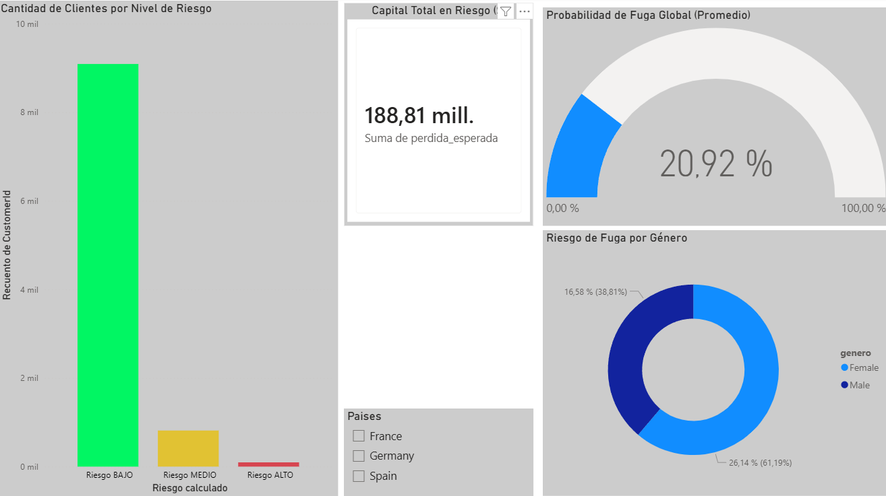
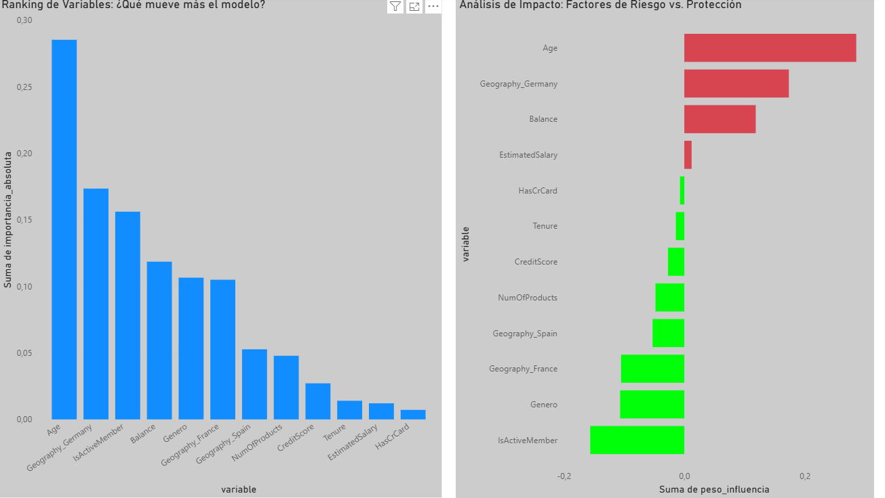

# 🏦 Sistema de Predicción de Fuga de Clientes (End-to-End Project)


## 💼 Descripción del Proyecto
Este proyecto simula un entorno empresarial real donde el objetivo es reducir el **Churn Rate** (Tasa de Abandono) de un banco internacional.
En lugar de solo predecir "quién se va", el sistema calcula el **Capital en Riesgo** (la pérdida monetaria potencial), permitiendo priorizar la retención de clientes de alto valor.

---

## 📸 Análisis de Resultados y Dashboards

### 1. Visión Ejecutiva: El Costo de la Fuga
En este primer tablero, nos enfocamos en el impacto financiero. El modelo identificó que, aunque la tasa de fuga es del 20%, el capital en riesgo representa una proporción mayor debido a la fuga de clientes "Premium".



**Conclusiones de Negocio:**
* **Capital Total en Riesgo:** Se detectaron más de **$188 Millones** en peligro de fuga inminente.
* **Geografía Crítica:** **Alemania** presenta la tasa de fuga más alta (doblando a Francia y España), sugiriendo problemas regionales de competitividad o atención al cliente.
* **Género:** Las clientes femeninas muestran una probabilidad de abandono un **12% mayor** que los masculinos, un insight clave para campañas de marketing segmentadas.

<br>

### 2. Explainable AI: ¿Por qué se van los clientes?
Aquí abrimos la "Caja Negra" del modelo de Inteligencia Artificial para entender qué factores empujan al cliente a irse.



**Insights descubiertos por el Modelo:**
* **Correlación Directa con la Edad:** El análisis revela una tendencia ascendente clara. Los clientes más jóvenes (<30 años) son los más leales (riesgo <10%), mientras que a partir de los **50 años**, la probabilidad de fuga se dispara por encima del **40-50%**, convirtiendo a los clientes senior en el segmento más crítico.
* **Saturación de Productos:** Se descubrió un patrón no lineal: tener 1 o 2 productos es ideal. Sin embargo, clientes con **3 o 4 productos** tienen una tasa de abandono de casi el **100%**. Esto indica que la venta cruzada agresiva está siendo contraproducente.
* **Score Crediticio:** Sorprendentemente, el puntaje de crédito no es un factor determinante para la fuga en este banco.

---

## ⚙️ Desarrollo del Proyecto (Pipeline)

El flujo de trabajo sigue una arquitectura de datos moderna, desde la ingesta hasta la visualización:

### Paso 1: Ingeniería de Datos (SQL)
* Ingesta de datos crudos (`RAW DATA`) en PostgreSQL.
* Creación de **Vistas SQL** para limpiar datos nulos y filtrar registros inactivos.
* Diseño de un esquema relacional optimizado para consulta.

### Paso 2: Machine Learning (Python & TensorFlow)
* Conexión a la base de datos mediante `SQLAlchemy`.
* **Preprocesamiento:** Codificación One-Hot para variables categóricas (Países, Género) y Escalado Estándar para numéricas (Salario, Balance).
* **Modelo:** Diseño de una **Red Neuronal Artificial (ANN)** con Keras:
    * *Capas Ocultas:* Activación `ReLU` para capturar patrones complejos.
    * *Capa de Salida:* Activación `Sigmoid` para obtener una probabilidad entre 0 y 1.
* **Write-Back:** El script inyecta las predicciones (`Probabilidad_Fuga`) nuevamente en la base de datos SQL para que estén disponibles para el negocio.

### Paso 3: Business Intelligence (Power BI)
* Conexión directa a la Vista Final de SQL.
* Creación de medidas DAX para calcular el KPI personalizado: `Capital en Riesgo = Balance * Probabilidad de Fuga`.
* Diseño de interfaz enfocada en la usabilidad para gerentes de zona.

---

## 🚀 Cómo ejecutar este proyecto

1.  **Clonar repositorio:**
    ```bash
    git clone [https://github.com/TU_USUARIO/Proyecto_Churn_Bank.git](https://github.com/TU_USUARIO/Proyecto_Churn_Bank.git)
    ```
2.  **Base de Datos:**
    * Ejecutar el script `script_base_datos.sql` en PostgreSQL.
    * Configurar el archivo `.env` (usar `.env.example` como guía).
3.  **Entrenar Modelo:**
    ```bash
    pip install -r requirements.txt
    python Creditos.py
    ```
4.  **Visualizar:**
    * Abrir el archivo `.pbix` con Power BI Desktop.

---

## 👤 Autor
**[Henault Nicolas]** - Data Analyst & Developer
